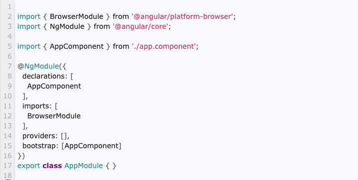

### The Angular Module organizes the related components 'belows' and arranges them into cohesive blocks of functionality.
- directives
- pipes
- services

### {{}}
double curly bracket syntax is known as interpolation

###
- selector
- templateUrl
- styleUrls
#### these are parts of @Component decorator 

###
- Angular Module
- metadata About the Modules
#### @NgModule class decorator to define

##

##
The declaration arrays are where we include the components, pipes, and directives that are part of this module.

We add all the other Angular Modules; this module uses in the imports array.

Include all the angular services part of this module in the providers‘ array.
